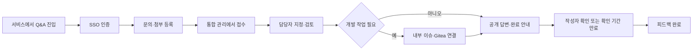
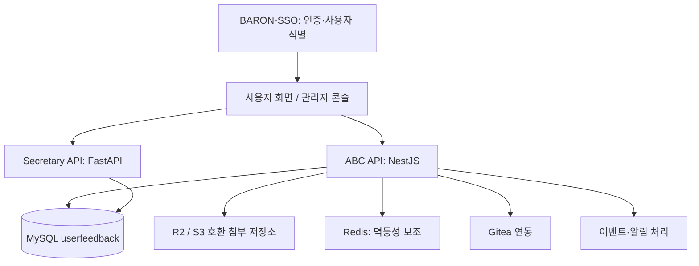

# Q&A 플랫폼 — 문서 검토 및 발표 내용 정리

작성일: 2026-09-22 · 자료 기준: 제공 ZIP, 2026-09-21

> 2026-09-23 수정: 현업 담당자·임원진·부서 동료를 위해 10장으로 재구성했다. 아래 기술 검토는 근거 확인용이며 실제 발표 순서와 대본은 `storyboard.md`를 기준으로 한다.

## 1. 검토 범위와 읽는 기준

ZIP의 Markdown은 총 143개, 1,350,864바이트다. 원문 전체를 로컬에 추출하고 문서별 제목·절·체크리스트를 목록화했다.

| 분류 | 수량 | 발표에서의 용도 |
| --- | ---: | --- |
| 프로젝트 관련 문서 | 79 | 제품 설명, 사용자 가이드, 설계, 구현 기록, 배포·이관, 저장소 안내 |
| 영문·일문 문서 | 52 | 각 26개. ABC 기본 제품 문서의 번역이며 별도 개발 성과로 중복 계산하지 않음 |
| Python 의존성 문서 | 12 | 라이선스와 FastAPI 개발 지침. 발표 기능에서 제외 |

프로젝트 문서 79개에도 목차 전용 파일, 행동 강령, 생성된 테스트 화면 스냅샷이 포함된다. 79개 모두가 독립된 기능 설계서는 아니다.

전체 목록은 로컬 `reference/catalog.md`, 경로·행 수·절·체크 수는 `reference/inventory.json`, 원문은 `reference/source/`에 보존했다. 체크 수는 동일 작업의 중복과 오래된 표시가 있으므로 완료율로 계산하지 않는다.

문서 근거는 아래에서 `원본 상대 경로 §절`로 표기한다. 원본을 공개 배포하지 않으므로 공개 페이지에서는 내부 파일 링크 대신 문서명을 사용한다.

## 2. 플랫폼을 한 문장으로 설명하기

**여러 서비스에서 들어오는 Q&A를 한곳에서 확인하고, 담당자 배정부터 답변·개발 이슈·완료 확인까지 연결하는 통합 관리 플랫폼.**

발표 제목 제안: **흩어진 문의를 하나의 처리 흐름으로 — Q&A 통합 관리 플랫폼**

발표용 보조 문구: **담당자와 개발자가 문의부터 해결까지 함께하는 업무 공간**

근거: `README.md §프로젝트 개요, 통합 관리가 필요한 이유, 프로젝트 목표와 처리 흐름`

## 3. 왜 만들었는가

기존에는 서비스별 회원·권한과 Q&A 관리가 분리되어 관리자가 여러 화면을 찾아다녀야 했다. 담당자, 답변, 첨부파일, 개발 이슈 처리 이력도 나뉘어 있었다.

BARON-SSO가 사용자 인증의 공통 기반을 제공하므로, 문의 처리도 공통 기준으로 연결하는 것이 개발 배경이다.

| 기존 운영의 문제 | 플랫폼의 대응 | 기대 효과 |
| --- | --- | --- |
| 서비스마다 별도 문의 확인 | 여러 프로젝트의 통합 관리 화면 | 확인을 위해 이동하는 화면 감소 |
| 담당자·처리 상태 불명확 | 담당자, 중요도, 상태, 최근 업데이트 | 미처리 항목과 처리 주체 파악 |
| 고객 답변과 내부 협의가 분산 | 공개 댓글과 내부 메모 분리 | 고객 응대와 내부 인수인계 연결 |
| 문의와 개발 작업 연결 부족 | 피드백 ↔ 내부 이슈 ↔ Gitea | 요청부터 개발 대응까지 이력 추적 |
| 사용자·관리자가 다른 정보 조회 | ABC API/DB를 원본으로 통일 | 동일 문의의 내용·상태 일관성 |

효과는 문서의 기대 효과다. 처리 시간 단축률, 누락 감소율 등 실제 성과 수치는 아직 제시할 근거가 없다.

## 4. 핵심 용어와 사용자

| 용어 | 발표용 설명 |
| --- | --- |
| RP | 문의가 들어오는 서비스 또는 접수 창구 |
| 프로젝트 | 서비스를 구분하는 관리 단위 |
| 채널 | 프로젝트 안의 세부 접수 창구와 입력 항목 설정 단위 |
| Q&A / 피드백 | 같은 요청을 사용자 화면에서는 Q&A, 관리자 화면에서는 피드백이라고 부름 |
| 이슈 | 문의를 해결하기 위한 작업 단위 |
| Gitea 이슈 | 개발자가 실제 수정 작업을 진행하는 외부 작업 항목 |
| 내부 메모 | 고객에게 공개하지 않는 담당자 간 협업 기록 |

사용자는 문의를 남기고 답변과 해결 여부를 확인한다. 프로젝트 담당자는 배정된 프로젝트의 문의를 처리한다. 시스템 관리자는 전체 설정과 여러 프로젝트의 운영을 관리한다. 개발자는 연결된 개발 이슈를 처리한다. 개발 업무를 맡는다는 이유만으로 시스템 관리자 권한을 갖는 것으로 설명하지 않는다.

근거: `docs/관리페이지-개념설명.md §2–9`, `docs/관리페이지-운영팀-사용가이드.md §2–4`

## 5. 하나의 문의로 설명하는 전체 흐름

이 도식은 문서가 정의하는 목표 업무 흐름이다. 외부 EG-BIM 작성 화면에서 이 전 과정이 운영 연결되었다는 증거는 아니다.

시연 예시: ‘EG-BIM에서 특정 작업 중 오류가 발생한다’는 가상 문의 하나를 등록 → 담당자 지정 → 재현 메모 → 개발 이슈 연결 → 조치 답변 → 완료 확인 순으로 보여준다. 실제 장애 사례나 고객 정보로 오인되지 않도록 가상 예시로 표시한다.

사용자에게 중요한 순간은 로그인 전환, 제출 직후 접수 확인, 처리 대기 중 상태 확인, 답변 이후 해결 확인이다. 따라서 발표도 메뉴를 나열하기보다 이 네 순간을 따라 구성한다.

근거: `docs/# EG-BIM Q&A 사용자 여정 맵.md §3–5`, `docs/관리페이지-운영팀-사용가이드.md §6–8`

## 6. 발표에서 보여줄 핵심 기능

| 기능 | 설명할 내용 | 적절한 화면 또는 자료 |
| --- | --- | --- |
| 사용자 문의 작성 | 제목·내용·구분, 첨부, 비밀글, 작성자 정보 | 작성 폼과 접수 결과 |
| 통합 관리 | 여러 프로젝트의 피드백·이슈 조회, 검색·필터·내 담당 | 통합 관리 목록 |
| 담당자와 우선순위 | 처리할 사람과 중요도, 상태 지정 | 피드백 상세 |
| 공개 답변 / 내부 메모 | 고객 안내와 재현·인수인계 기록의 분리 | 두 영역을 비교한 상세 화면 |
| 이슈 연결 | 여러 문의를 같은 이슈에 묶거나 한 문의에 여러 이슈 연결 | 피드백–이슈 관계도 |
| Gitea 연동 | 기존 이슈 검색·연결, 신규 생성, 상태 확인 | 내부 이슈와 Gitea 연결 화면 |
| 완료 절차 | 개발 완료 이후 고객 안내와 해결 확인까지 추적 | 상태 흐름도 |
| 권한과 이력 | 프로젝트별 접근, 내부 정보 구분, 소프트 삭제 이력 | 역할별 보기 비교 |

기본 ABC 문서에는 칸반, 필드 설정, CSV/Excel 내보내기, AI 필드와 이슈 추천, OAuth, Jira, Webhook도 있다. 이들은 원본 제품의 기능 설명이며, 이번 커스터마이징의 신규 성과나 현재 활성화 기능으로 자동 간주하지 않는다.

근거: `README.md §5`, `docs/multi-project-admin-dashboard-design.md §11`, `docs/integrated-management-feedback-tasks.md`, `apps/docs/docs/00-introduction/02-key-features.md`

## 7. 상태와 완료의 의미

후기 관리페이지 문서 기준은 **신규 → 접수 → 진행중 → 완료**, 필요할 때 **보류**다.

피드백 상태와 이슈 상태는 서로 다른 업무 상태다. 연결 이벤트가 상태 전이에 영향을 줄 수 있지만 한 상태로 합쳐지지는 않는다.

| 상황 | 처리 원칙 |
| --- | --- |
| 관리자가 신규 피드백을 처음 열람 | 접수로 전환하는 자동화 규칙 |
| 처리 댓글 또는 이슈 연결 | 신규·접수에서 진행중으로 전환하는 규칙 |
| 연결 이슈 일부만 완료 | 피드백을 완료하지 않음 |
| 모든 이슈 완료 | 관리자 결과 확인과 완료 안내 필요 |
| 완료 안내 등록 | 진행중 유지 + 작성자 확인 대기 메타데이터 |
| 작성자 확인 또는 기간 만료 | 조건을 만족하면 완료 |
| 보류 중 이벤트 발생 | 자동 이벤트가 보류를 덮어쓰지 않음 |
| 완료 확인 전 재문의 | 확인 대기 해제, 진행중 유지 |
| 이미 완료된 문의의 재문의 | 관리자 검토 후 수동 재개 |

‘작성자 확인 대기’는 여섯 번째 상태가 아니라 별도 표시다. 확인 기간의 실제 설정값은 발표 자료에서 임의로 정하지 않는다.

근거: `docs/admin-console-integration-feedback-requirements-2026-09-02.md §8–9`. 해당 문서는 상단에 초안이라고 쓰여 있으면서 하단에는 구현·검증 완료 표시가 있다. 상태 자동화는 **문서상 구현 기록 있음 / 실제 시연 확인 필요**로 분류한다.

## 8. 기술 구조와 직접 확장한 부분

이 그림은 저장소 README와 단일 DB 전환 문서 기준의 논리 구조다. 외부 EG-BIM 작성 화면은 별도의 Worker·R2·OIDC 진입 구조로 설명되어 있어 Next.js 관리자 화면과 구분한다. 위 도식은 세부 호출 방향과 모든 프록시를 생략했다.

- **ABC 기반 활용:** 프로젝트·채널·필드·피드백·이슈 관리와 기본 관리자 기능.
- **사내 업무 확장:** BARON-SSO 연계, 사용자 작성 경험, 프로젝트 통합 관리, 담당자·내부 메모, Gitea, 완료 확인, 알림 정책.
- **원본 일원화:** ABC API/DB가 피드백 제목·본문·상태·댓글·첨부의 기준이다. Secretary는 접근·워크스페이스·업무 보조를 담당한다.
- **인증과 권한 분리:** SSO가 신원을 확인하고 내부 프로젝트 권한이 접근 범위를 결정한다. 테넌트만으로 관리자 권한을 부여하지 않는다.
- **식별자 전환:** 최신 UUID 문서와 9월 17일 ERD는 UUID v7 / `BINARY(16)`을 기준으로 한다. 초기 정수 PK 비교 문서는 선택 과정이다.
- **재시도 중복 방지:** UUID, 원본 식별 키, 멱등 키와 MySQL Unique 제약을 구분한다. UUID만 새로 생성한다고 재시도 중복이 해결되는 것은 아니다.
- **확장 준비:** 현재 단일 MySQL 기준이며 샤딩은 향후 부하에 따른 검토 항목이다.

근거: `README.md §2–4`, `docs/abc-single-database-migration-tasks.md`, `docs/uuidv7-first-distributed-design-and-task-list.md §2`, `docs/local-userfeedback-erd.md`, `docs/# EG-BIM Q&A 로그인부터 글 저장까지 전이맵.md`

## 9. 문서상 구현 기록과 실제 운영 확인 구분

| 영역 | 문서에서 확인되는 수준 | 발표 표현 |
| --- | --- | --- |
| 통합관리·담당자·댓글·이슈·Gitea | README 및 작업 기록에 구현 기재 | 핵심 기능으로 소개, 시연 환경 확인 |
| 5단계 상태 자동화·완료 확인 | 후기 작업 목록에 구현 및 테스트 완료 표시 | 처리 규칙 소개, 실제 화면으로 확인 |
| 소프트 삭제와 이력 | 9월 8일 작업 문서에 적용 기록 | 운영 이력 보존 기능으로 설명 |
| UUID 전환·중복 방지 | 구현·로컬 테스트·ERD 기록 | 기술 개선 사례 |
| 단일 DB | 로컬 적용·임시 DB 검증 기록, 스테이징 확인 항목 잔존 | 설계와 로컬 검증으로 설명 |
| 외부 EG-BIM 작성 화면 | 9월 21일 문서에서 `apiBaseUrl` 공란, localStorage 테스트 모드 | UI 흐름과 실제 운영 연결을 구분 |
| 네이버웍스 | 어댑터 구현·로컬 검증 기록, 실발송 검증 필요 | 연동 구현과 실발송 검증을 구분 |
| 카카오톡·SMS | 9월 21일 전이맵에서 어댑터·유형별 분기 별도 구현 명시 | 향후 확장 |
| 기존 EGBIM 데이터 이관 | 계획·생성 스크립트 안내·과거 실행 흔적 혼재, 제품 최종 이관은 미완료 전제 | 운영 전환 과제 |
| 신청·결재·자산·차량·원격지원 | 초기 설계·확장 시나리오 | 장기 확장 가능성 |
| AI 추천·분석 | ABC 기본 제품 가이드와 초기 로드맵 | 도입 기반 기능, 현재 적용 여부 확인 필요 |

이번 자료만으로 ‘전체 시스템 운영 완료’, ‘모든 RP 연결 완료’, ‘외부 알림 실발송 완료’라고 결론내리지 않는다.

## 10. 문서 사이의 차이와 발표 기준

| 주제 | 서로 다른 기록 | 발표에 사용할 기준 |
| --- | --- | --- |
| DB | 초기 PostgreSQL / ABC·Secretary 별도 MySQL / 단일 MySQL | README + 9월 7일 단일 DB 결정. 실제 스테이징 적용은 별도 확인 |
| 권한 원본 | 역할 설계는 Secretary 원본 / 단일 DB 전환은 ABC 사용자·역할·멤버 원본 | 역할의 업무 의미를 본문에 사용, 저장 책임은 단일 DB 전환 기준 |
| 피드백 원본 | 초기 이중 저장 / 이후 ABC SSOT | ABC API/DB를 기준으로 설명 |
| PK | INT·BIGINT·ULID 비교 / UUID v7 전환 기록 | UUID 작업 문서 + 9월 17일 ERD |
| 상태 | 초기 6단계 / 후기 5단계 | 후기 자동화 문서 + 운영팀 가이드 |
| 댓글 저장 | 초기 Secretary ticket_comments / ABC feedback_comments | ABC 매핑 흐름은 SSOT 문서 기준, 보조·호환 경로와 구분 |
| 알림 | 8월 WORKS 정책 / 9월 사내·외부 채널 분리안 | WORKS 구현 기록 + 카카오·SMS는 후속 구현 |
| 대시보드 지표 | 초기 평균 처리 시간·연결률 포함 / 이후 제거 요구 | 카드 수·구성은 실제 최신 화면 확보 후 반영 |
| API | 기본 ABC 가이드의 정수 예제 / UUID·REST 경로 전환 | 최신 UUID 계약과 실제 호출 확인 우선 |
| 작성 화면 | Next.js 지원 화면 / 별도 EG-BIM Worker·R2 화면 | 동일한 화면으로 합치지 않고 접점별 설명 |

파일명에 `v2`가 있거나 README에서 우선 참고라고 소개되어도 모든 내용이 최신은 아니다. 기능별 후속 결정과 적용 기록을 함께 보아야 한다.

## 11. 숫자를 사용할 때의 범위

- 143개는 이번 ZIP의 문서 수다. 개발 기능 수가 아니다.
- 초기 이관 계획의 게시글 427건·댓글 677건·게시글 첨부 194건·댓글 이미지 42건은 당시 덤프 기준이다. 현재 운영량이나 이관 완료량이 아니다.
- 원본 ABC 소개 문서의 ‘1,000만 MAU 서비스 활용’은 기반 제품 설명이며 이 플랫폼의 이용자 수가 아니다.
- 연 5만 건은 설계 가정이다. 실제 수집량으로 표현하지 않는다.
- 9월 16일 런북의 API 단위 993건, E2E 129건·27건 등은 문서에 기록된 당시 검증 결과다. 이번 검토에서 재실행한 수치가 아니다.
- 런북의 로컬 DB 벤치마크는 인덱스·단일 노드 기준선이다. 서비스 전체 응답속도나 운영 용량 보증으로 사용하지 않는다.

## 12. 후속 발표 편집에 필요한 정보

1. 청중과 발표 시간: 우선 사내 구성원 대상 15~20분으로 초안 구성.
2. ‘2분기’가 행사명인지 성과 기간인지: 자료는 8~9월 기록이 다수이므로 실적 기간 확정 필요.
3. 제품 표시명과 발표자명.
4. 현재 실제 접속 화면: 작성·목록·관리 상세·이슈 연결·완료 확인.
5. 시연 가능한 환경의 API 연결과 알림 수준.
6. 실제 성과 지표가 있다면 적용 서비스 수·문의량·응답 시간 등 측정 기준과 기간.

원본 ZIP에는 링크로 참조되는 제품 스크린샷 파일과 플랫폼 소스 코드가 포함되지 않았다. 초기 HTML의 도식은 문서 기반 설명이며 실제 UI 캡처로 표시하지 않는다.
